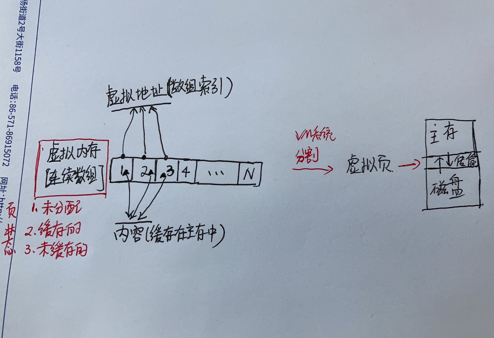

# 内存管理（物理内存管理，虚拟内存管理）

## 物理内存管理
### 基本概念
* 页(page)：内核把**物理页**作为内存管理的**基本单位**(只是衡量内存大小的一种单位，一般4KB~2MB，这么大的原因：DRAM缓存不命中要由磁盘来服务，代价比较大)。
* 区(zone)：内核根据用途把页划分为不同的区，形成不同的内存池。
* 内存管理单元(MMU)：管理内存并把虚拟地址转化为物理地址的硬件，通常以页为单位进行处理。


### 页简单了解
每个物理页的结构，内核通过该结构可以知道：
* 一个页是否空闲
* 如果页被分配，内核需要知道谁拥有这个页
```
struct page{
    unsigned long        flags;
    atomic_t             _count; //存放页的引用计数，表示这一页被引用了多少次
    atomic_t             _mapcount; 
    unsigned long        private;
    struct address_space *mapping;
    pgoff_t              index;
    struct               list_head;
    void                 *virtual;//页的虚拟地址
}
```
### 区简单了解
内核使用区对具有相似特性的页进行分组。
由于硬件存在缺陷而引起内存寻址问题：
* 一些硬件只能用某些特定的内存地址来执行DMA(直接内存访问)。
* 一些体系结构的内存的物理寻址范围比虚拟寻址范围大得多，导致一些内存不能永久地映射到内核空间上。

Linux主要使用四种区:
* ZONE_DMA: 这个区包含的页能用来执行DMA操作
* ZONE_DMA32: 
* ZONE_NORMAL: 都是能正常映射的页
* ZONE_HIGHEM: “高端内存”，其中的页不能用就地映射到内核地址空间。

### 内核空间分配内存(页)的函数：
* kmalloc()或者低级页分配器:目的--需要连续的物理页；获得以字节为单位的一块内核内存，kmalloc()确保页在物理地址上也是连续的。这是内核中内存分配的常用方式。这些函数需要关注两个最常用的标准GFP_ATOMIC和GFP_KERNEL。
    常用标志|作用
    -|:-:|-:
    GFP_ATOMIC|表示进行不睡眠的高优先级分配，这是中断处理程序和不能睡眠的代码所需要的
    GFP_KERNEL|对于可以睡眠的代码，比如不持有自旋锁的进程上下文

* vmalloc(): 分配的内存虚拟地址是连续的，而物理地址是非连续的，与用户空间的内存分配很相似。相对于kmalloc()有一定的性能损失。

* alloc_pages(): 从高端内存进行分配，因为高端内存可能没有被映射，访问它的唯一方式就是通过相应的struct page结构。

* slab分配器: slab层给每个处理器维持一个对象高速缓存(空闲链表)，这种高速缓存会极大的提高对象分配和回收的性能。注意！slab不是频繁的进行分配和释放内存，而是为你把事先分配好的对象放到高速缓存中。当你需要一块新的内存来存放数据时，slab层一般无需另外去分配内存，只需要从高速缓存中得到一个对象就可以了。

用户空间获取内存的函数：
* malloc(): 返回的页在进程的虚拟地址空间内是连续的，不能保证在物理RAM中也连续。


## 虚拟内存管理
目的：用来管理用户空间中的内存(进程地址空间)。
首先，我们要知道，虚拟内存是数组。是一个存放在磁盘上的，由N个连续的字节大小的单元组成的，数组。


### 基本概念
* 页表：存放在物理内存中的一种数据结构，用来将虚拟页映射到物理页，内核来维护页表的内容。

下图是页表的基本结构，是一个数组（Page Table Entry,PTE 页表条目数组。
其中四个虚拟页(VP1，VP2，VP4，VP7)被缓存在DRAM中。两个页(VP0,VP5)还未被分配。剩下的表示已经被分配，但是还未被缓存。


### 总结
在运行一个进程的时候，它所需要的内存空间可能大于系统的物理内存容量。通常一个进程会有4G的空间，但是物理内存并没有这么大，所以这些空间都是虚拟内存，它的地址都是逻辑地址，每次在访问的时候都需要映射成物理地址。
当进程访问某个逻辑地址的时候，会去查看页表，如果页表中没有相应的物理地址，说明内存中没有这页的数据，发生缺页异常，这时候进程需要把数据从磁盘拷贝到物理内存中。如果物理内存已经满了，就需要覆盖已有的页，如果这个页曾经被修改过，那么还要把它写回磁盘。